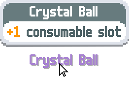

# Text Styling

Balatro includes a very basic formatting syntax for styling and formatting displayed text in-game. Where supported, text can be styled with the use of *style modifier codes* included within the text string. For example, the text string:

<table>
 <tr> </tr> <!-- Empty row to manipulate the background colour of the next table row -->
 <tr>
  <td>

   ```pas
   {C:blue}+1{} hand     
   ```
  </td>
  <td>

  produces
  <br>
  </td>
  <td>
   <picture>
    <source media="(prefers-color-scheme: dark)" srcset="Assets/Text-Styling/example_+1_hand_dark.svg">
    
   </picture>
   <br>
  </td>
 </tr>
</table>

Most SMODS objects that display description text will parse and style text strings automatically when loading from [localization files](https://github.com/Steamodded/smods/wiki/Localization#localization-files-recommended) or [`loc_txt`](https://github.com/Steamodded/smods/wiki/Localization#loc_txt). This includes the text strings of descriptions for Achievements, Consumables, Decks, Jokers, Vouchers, and more.

Style modifiers are not additive - text will only be styled by the modifiers contained within the previous set of curly braces. Using empty braces `{}` will reset text styling for text after it.

Additionally, multiple modifiers can be [combined](#combinations) in a single set of curly braces. For example, the text string:

<table>
 <tr> </tr> <!-- Empty row to manipulate the background colour of the next table row -->
 <tr>
  <td>

   ```pas
   {X:mult,C:white}X0.5{}     
   ```
  </td>
  <td>

  produces
  <br>
  </td>
  <td>
   
   <br>
  </td>
 </tr>
</table>


Valid style modifiers are as follows:
<table>
 <tr>
  <td>   
   <a href="#defined-text-colour-modifier-c"><b>Defined text colour</a>
  </td>
  <td>
   <code>{C:<i>colour-key</i>}</code>
  </td>
 </tr>
 <tr>
  <td>
   <a href="#defined-background-colour-modifier-x"><b>Defined background colour</a>
  </td>
  <td>
   <code>{X:<i>colour-key</i>}</code>
  </td>
 </tr>
 <tr>
  <td>
   <a href="#variablecustom-text-colour-modifier-v"><b>Variable/custom text colour</a>
  </td>
  <td>
   <code>{V:<i>colour-index</i>}</code>
  </td>
 </tr>
 <tr>
  <td>
   <a href="#variablecustom-background-colour-modifier-b"><b>Variable/custom background colour</a>
  </td>
  <td>
   <code>{B:<i>colour-index</i>}</code>
  </td>
 </tr>
 <tr>
  <td>
   <a href="#text-motion-modifier-e"><b>Text motion</a>
  </td>
  <td>
   <code>{E:<i>motion-index</i>}</code>
  </td>
 </tr>
 <tr>
  <td>
   <a href="#text-hover-tooltip-modifier-t"><b>Text hover tooltip</a>
  </td>
  <td>
   <code>{T:<i>tooltip-key</i>}</code>
  </td>
 </tr>
 <tr>
  <td>
   <a href="#text-scale-modifier-s"><b>Text scale</a>
  </td>
  <td>
   <code>{s:<i>scale</i>}</code>
  </td>
 </tr>
  <tr>
  <td>
   <a href="#text-font-modifier-f"><b>Font</a>
  </td>
  <td>
   <code>{f:<i>font_key</i>}</code>
  </td>
 </tr>
 <tr>
  <td>
   <b>No modifiers</b> (use default styling)
  </td>
  <td>
   <code>{}</code>
  </td>
 </tr> 
</table>

> [!IMPORTANT]
> Modifiers are **case sensitive** – `{s:}` and `{f:}` must be lowercase, while all other modifiers are UPPERCASE.

---


## Defined text colour modifier `{C:}`
<code>{C:<i>colour-key</i>}</code> changes the color of the text, where *`colour-key`* is the **key** of a colour defined in [`G.ARGS.LOC_COLOURS`](#loc_colours-table).


### Examples

<!--- Single-indented table is necessary for code blocks to function properly -->
<table>
 <tr>
  <td> Text string </td> <td> <code>loc_vars</code> </td> <td> Result </td>
 </tr>
 <tr>
  <td colspan=2>
<!-- Code blocks require a preceding empty line when inside HTML tables -->

   ```pas
   {C:mult}+4{} Mult
   ```
  </td>
  <td align="center">
   <picture>
    <source media="(prefers-color-scheme: dark)" srcset="Assets/Text-Styling/example_+4_Mult_dark.svg">
    
   </picture>
  </td>
 </tr>
 <tr> </tr> <!--- Empty row to ensure all codeblock rows have the same background colour -->
 <tr>
  <td colspan=2>

```pas
{C:attention}1{} free {C:green}Reroll{}
```
  </td>
  <td align="center">
   <picture>
    <source media="(prefers-color-scheme: dark)" srcset="Assets/Text-Styling/example_1_free_Reroll_dark.svg">
    
   </picture>
  </td>
 </tr>
 <tr> </tr> <!--- Empty row to ensure all codeblock rows have the same background colour -->
 <tr>
  <td>

   ```pas
   {C:green}#1# іn #2#{} chance     
   ```
  </td>
  <td>

   ```lua
   vars = {
     G.GAME.probabilities.normal, -- 1
     card.ability.extra.odds      -- 6
   }
   ```
  </td>
  <td align="center">
   <picture>
    <source media="(prefers-color-scheme: dark)" srcset="Assets/Text-Styling/example_1_in_6_chance_dark.svg">
    
   </picture>
  </td>
 </tr>
</table>


## Defined background colour modifier `{X:}`
<code>{X:<i>colour-key</i>}</code> sets the background color of the text, where *`colour-key`* is the **key** of a colour defined in [`G.ARGS.LOC_COLOURS`](#loc_colours-table).

This modifier is usually combined with the text colour modifier to make <picture>
    <source media="(prefers-color-scheme: dark)" srcset="Assets/Text-Styling/example_X3_Mult_dark.svg">
    
</picture> labels.

This modifier uniquely strips all whitespace from the styled text, so text like <code>{X:gold}&nbsp;W&nbsp;I&nbsp;D&nbsp;E&nbsp;{}</code> is rendered as . This can be helpful for improving the readability of otherwise dense strings.


### Examples

<table>
 <tr>
  <td> Text string </td> <td> <code>loc_vars</code> </td> <td> Result </td>
 </tr>
 <tr>
  <td colspan=2>

   ```pas
   {X:mult,C:white}X3{} Mult{}
   ```
  </td>
  <td align="center">
   <picture>
    <source media="(prefers-color-scheme: dark)" srcset="Assets/Text-Styling/example_X3_Mult_dark.svg">
    
   </picture>
  </td>
 </tr>
 <tr> </tr> <!--- Empty row to ensure all codeblock rows have the same background colour -->
 <tr>
  <td colspan=2>

   ```pas
   {X:chips,C:white} X 1 . 5 {} Chips{}
   ```
  </td>
  <td align="center">
   <picture>
    <source media="(prefers-color-scheme: dark)" srcset="Assets/Text-Styling/example_X1.5_Chips_dark.svg">
    
   </picture>
  </td>
 </tr>
 <tr> </tr> <!--- Empty row to ensure all codeblock rows have the same background colour -->
 <tr>
  <td>
   
   ```pas
   {X:mult,C:white} X#1# {}     
   ```
  </td>
  <td>

  ```lua
  vars = {
    card.ability.extra.xmult -- 0.5
  }
  ```
  </td>
  <td align="center">
   
  </td>
 </tr>
</table>


## Variable/custom text colour modifier `{V:}`
<code>{V:<i>index</i>}</code> changes the colour of the text to a custom colour provided as an entry in the [`loc_vars`](https://github.com/Steamodded/smods/wiki/Localization#loc_vars) `vars.colours` table. See [Localization](https://github.com/Steamodded/smods/wiki/Localization#loc_vars) for more details.

*`index`* is the array index of the colour entry in the `vars.colours` table.


### Examples

<table>
 <tr>
  <td> Text string </td> <td> <code>loc_vars</code> </td> <td> Result </td>
 </tr>
 <tr>
  <td>
   
   ```pas
   {V:1}FF00FF{}
   ```
  </td>
  <td>
   
   ```lua
   vars = {
     colours = { HEX('FF00FF') }
   }
   ```
  </td>
  <td align="center">
   
  </td>
 </tr>
 <tr> </tr> <!--- Empty row to ensure all codeblock rows have the same background colour -->
 <tr>
  <td>
   
   ```pas
   {V:2}#2#{} suit{}     
   ```
  </td>
  <td>
   
   ```lua
   vars = {
     'Spade',
     'Heart',
     'Club',
     'Diamond',
     colours = { 
       G.C.SUITS.Spades,
       G.C.SUITS.Hearts,
       G.C.SUITS.Clubs,
       G.C.SUITS.Diamonds
     }
   }
   ```
  </td>
  <td align="center">
   <picture>
    <source media="(prefers-color-scheme: dark)" srcset="Assets/Text-Styling/example_Heart_suit_dark.svg">
    
   </picture>
  </td>
 </tr>
</table>


## Variable/custom background colour modifier `{B:}`
> [!NOTE]
> This modifier is added by Steamodded and is not supported by vanilla Balatro.

<code>{B:<i>index</i>}</code> changes the colour of the background to a custom colour provided as an entry in the [`loc_vars`](https://github.com/Steamodded/smods/wiki/Localization#loc_vars) `vars.colours` table. See [Localization](https://github.com/Steamodded/smods/wiki/Localization#loc_vars) for more details.

*`index`* is the array index of the colour entry in the `vars.colours` table.

Unlike the similar [Defined background modifier `{X:}`](#defined-background-colour-modifier-x), `{B:}` does **not** remove or change the whitespace of styled text, so displayed contents will remain the same as their input string.


### Examples

<table>
 <tr>
  <td> Text string </td> <td> <code>loc_vars</code> </td> <td> Result </td>
 </tr>
 <tr>
  <td>
   
   ```pas
   {B:1}00FF00{}
   ```
  </td>
  <td>
   
   ```lua
   vars = {
     colours = { HEX('00FF00') }
   }
   ```
  </td>
  <td align="center">
   
  </td>
 </tr>
 <tr> </tr> <!--- Empty row to ensure all codeblock rows have the same background colour -->
 <tr>
  <td>
   
   ```pas
   {B:1,V:2}Oh no!{} Anyway... 
   ```
  </td>
  <td>
   
   ```lua
   vars = {
     colours = { 
       {1, 0, 0, 1}, --#FF0000
       {0, 0, 0, 1}  --#000000
     }
   }
   ```
  </td>
  <td align="center">
   <picture>
    <source media="(prefers-color-scheme: dark)" srcset="Assets/Text-Styling/example_Oh_no_Anyway_dark.svg">
    
   </picture>
  </td>
 </tr>
 <tr> </tr> <!--- Empty row to ensure all codeblock rows have the same background colour -->
 <tr>
  <td>
   
   ```pas
   {B:1,V:2}#1#{B:2,V:1}#2#{}     
   ```
  </td>
  <td>
   
   ```lua
   vars = {
     'Spa',
     'rts',
     colours = { 
       G.C.SUITS.Spades,
       G.C.SUITS.Hearts,
     }
   }
   ```
  </td>
  <td align="center">
   
  </td>
 </tr>
</table>


## Text motion modifier `{E:}`
`{E:1}` applies a pop-in effect when the text is first displayed, and a floating animation to each letter in the text.

`{E:2}` applies a bumping animation to each letter in sequence.

`{E:}` is incompatible with background modifiers `{X:}` and `{B:}`. If background modifiers are set, `{E:1}` will only show a pop-in effect with no motion, and `{E:2}` will be ignored.

### Examples

<table>
 <tr>
  <td> Text string </td> <td> Result </td>
 </tr>
 <tr>
  <td>

   ```pas
   {C:green,E:1}probabilities{}     
   ```
  </td>
  <td align="center">
   
  </td>
 </tr>
 <tr> </tr> <!--- Empty row to ensure all codeblock rows have the same background colour -->
 <tr>
  <td>

   ```pas
   {E:2}Joker{}
   ```
  </td>
  <td align="center">
   <picture>
    <source media="(prefers-color-scheme: dark)" srcset="Assets/Text-Styling/example_Joker_dark.svg">
    
   </picture>
  </td>
 </tr>
 <tr> </tr> <!--- Empty row to ensure all codeblock rows have the same background colour -->
 <tr>
  <td>
   
   ```pas
   {C:red,E:2}self destructs{}
   ```
  </td>
  <td align="center">
   
  </td>
 </tr>
</table>


## Text hover tooltip modifier `{T:}`
<code>{T:<i>tooltip-key</i>}</code> adds tooltip functionality to the text, which displays a small tooltip UI above the text when the text is hovered over.

*`tooltip-key`* must be the name of a key found in either `G.P_CENTERS` or `G.P_TAGS`. See the entries in the SMODS.Center category and [SMODS.Tag](https://github.com/Steamodded/smods/wiki/SMODS.Tag) for more.


### Examples

<table>
 <tr>
  <td> Text string </td> <td> Result </td>
 </tr>
 <tr>
  <td>
   <br><br>

   ```pas
   {C:tarot,T:v_crystal_ball}Crystal Ball{}     
   ```
  </td>
  <td align="center">
   
  </td>
 </tr>
</table>


## Text scale modifier `{s:}`
> [!IMPORTANT] 
> This modifier requires the **lowercase** `s`, unlike other modifiers which must be UPPERCASE.

<code>{s:<i>scale</i>}</code> changes the size of the text.

*`scale`* is a decimal value where the default size is 1.0.

Vanilla Balatro only uses `s:0.8`, `s:0.85` and `s:1.1` text scales.


### Examples

<table>
 <tr>
  <td> Text string </td> <td> Result </td>
 </tr>
 <tr>
  <td>

  ```pas
  {s:0.8}0.8 {s:1.0}1.0 {s:1.1}1.1{}     
  ```
  </td>
  <td align="center">
   <picture>
    <source media="(prefers-color-scheme: dark)" srcset="Assets/Text-Styling/example_0.8_1.0_1.1_dark.svg">
    
   </picture>
  </td>
 </tr>
</table>

## Text font modifier `{f:}`
> [!IMPORTANT] 
> This modifier requires the **lowercase** `f`, unlike other modifiers which must be UPPERCASE.

<code>{f:<i>font</i>}</code> changes the font of the text.

*`font`* is a f value ranging from `1` to `9` in vanilla, to add [custom fonts](https://github.com/Steamodded/smods/wiki/SMODS.Font) you need to set the value as the font's full key (`modname_font`).

### Examples
<table>
 <tr>
  <td>Text string</td>
  <td>Font Name</td>
  <td>Assigned Language</td>
  <td>Result</td>
 </tr>

 <tr>
  <td>
   
   ```pas
{f:1}Hello{}
```
  </td>
  <td>m6x11 plus</td>
  <td>Default</td>
  <td align="center">
   <picture>
    <source media="(prefers-color-scheme: dark)" srcset="Assets/Text-Styling/example_font_hello_1_dark.svg">
    
   </picture>
  </td>
 </tr>

 <tr>
  <td>
   
   ```pas
{f:2}Hello, 你好{}
```
  </td>
  <td>Noto Sans SC Bold</td>
  <td>Simplified Chinese</td>
  <td align="center">
   <picture>
    <source media="(prefers-color-scheme: dark)" srcset="Assets/Text-Styling/example_font_hello_2_dark.svg">
    
   </picture>
  </td>
 </tr>

 <tr>
  <td>
   
   ```pas
{f:3}Hello, 您好{}
```
  </td>
  <td>Noto Sans TC Bold</td>
  <td>Traditional Chinese</td>
  <td align="center">
   <picture>
    <source media="(prefers-color-scheme: dark)" srcset="Assets/Text-Styling/example_font_hello_3_dark.svg">
    
   </picture>
  </td>
 </tr>

 <tr>
  <td>
   
   ```pas
{f:4}Hello, 안녕하세요{}
```
  </td>
  <td>Noto Sans KR Bold</td>
  <td>Korean</td>
  <td align="center">
   <picture>
    <source media="(prefers-color-scheme: dark)" srcset="Assets/Text-Styling/example_font_hello_4_dark.svg">
    
   </picture>
  </td>
 </tr>

 <tr>
  <td>
   
   ```pas
{f:5}こんにちは{}
```
  </td>
  <td>Noto Sans JP Bold</td>
  <td>Japanese</td>
  <td align="center">
   <picture>
    <source media="(prefers-color-scheme: dark)" srcset="Assets/Text-Styling/example_font_hello_5_dark.svg">
    
   </picture>
  </td>
 </tr>

 <tr>
  <td>
   
   ```pas
{f:6}Hello, Здравствуйте{}
```
  </td>
  <td>Noto Sans Bold</td>
  <td>Russian</td>
  <td align="center">
   <picture>
    <source media="(prefers-color-scheme: dark)" srcset="Assets/Text-Styling/example_font_hello_6_dark.svg">
    
   </picture>
  </td>
 </tr>

 <tr>
  <td>
   
   ```pas
{f:7}Hello{}
```
  </td>
  <td>m6x11 plus</td>
  <td>None*</td>
  <td align="center">
   <picture>
    <source media="(prefers-color-scheme: dark)" srcset="Assets/Text-Styling/example_font_hello_7_dark.svg">
    
   </picture>
  </td>
 </tr>

 <tr>
  <td>
   
   ```pas
{f:8}Hello{}
```
  </td>
  <td>Go Noto Current Bold</td>
  <td>All1**</td>
  <td align="center">
   <picture>
    <source media="(prefers-color-scheme: dark)" srcset="Assets/Text-Styling/example_font_hello_8_dark.svg">
    
   </picture>
  </td>
 </tr>

 <tr>
  <td>
   
   ```pas
{f:9}Hello{}
```
</td>
  <td>Go Noto CJK Core</td>
  <td>All2**</td>
  <td align="center">
   <picture>
    <source media="(prefers-color-scheme: dark)" srcset="Assets/Text-Styling/example_font_hello_9_dark.svg">
    
   </picture>
  </td>
 </tr>

 <tr>
  <td>
   
   ```pas
{f:modname_fontkey}Hello{}
```
  </td>
  <td><a href="https://github.com/Steamodded/smods/wiki/SMODS.Font">Custom Font</a> (example: Comic Sans MS)</td>
  <td>Custom</td>
  <td align="center">
   <picture>
    <source media="(prefers-color-scheme: dark)" srcset="Assets/Text-Styling/example_font_hello_10_dark.svg">
    
   </picture>
  </td>
 </tr>
</table>

*It differs from the default font from the parameters `TEXT_HEIGHT_SCALE = 0.9` and `TEXT_OFFSET = {x=10,y=15}`

**These are the language names given in the original `game.lua` file.


## Combinations
Some style codes can be combined within one set of curly braces, like `{X:mult,C:white}`.

- `{T:}`, `{f:}` and `{s:}` are compatible with all other modifiers.

- Background modifiers `{X:}` or `{B:}` can be used in conjunction with text colour modifiers `{C:}` or `{V:}`.

- Text motion modifier `{E:}` is incompatible with background modifiers `{X:}` and `{B:}` - if background modifiers are set, `{E:1}` will only show a pop-in effect with no motion, and `{E:2}` will be ignored.

- `{C:}` and `{V:}` are exclusive - if both are used, `{C:}` will be ignored.

- `{X:}` and `{B:}` are exclusive - if both are used, `{X:}` will be ignored.


### Examples

<table>
 <tr>
  <td> Text string </td> <td> <code>loc_vars</code> </td> <td> Result </td>
 </tr>
 <tr>
  <td colspan=2>

   ```pas
   {X:mult,C:white}X0.5{}
   ```
  </td>
  <td align="center">
   
  </td>
 </tr>
 <tr> </tr> <!--- Empty row to ensure all codeblock rows have the same background colour -->
 <tr>
  <td colspan=2>

   ```pas
   {C:edition,E:1,s:2}YOU WIN!{}
   ```
  </td>
  <td align="center">
   
  </td>
 </tr>
 <tr> </tr> <!--- Empty row to ensure all codeblock rows have the same background colour -->
 <tr>
  <td>

   ```pas
   {s:0.8}({V:1,s:0.8}lvl.#1#     
   {s:0.8}){} Level up{}
   ```
  </td>
  <td>
  
   ```lua
   vars = {
     G.GAME.hands[card.config.hand_type].level,
     colours = { 
       G.C.HAND_LEVELS[math.min(7,
         G.GAME.hands[card.config.hand_type].level
       )]
     }
   }
   ```
  </td>
  <td align="center">
   <picture>
    <source media="(prefers-color-scheme: dark)" srcset="Assets/Text-Styling/example_lvl.2_Level_up_dark.svg">
    
   </picture>
  </td>
 </tr>
</table>


## Named colours dictionary (`G.ARGS.LOC_COLOURS`)
<a name="loc_colours"></a>
 
<a name="loc_colours-table"></a>
<table>
 <tr>
  <td><b> Colour </td> <td><b> Key </td> <td><b> Value </td> <td align="center"><b> Example </td> <td align="center"><b> Note </td>
 </tr>
 <tr>
  <td>
   
  </td>
  <td>
   <code><b>red</code>
  </td>
  <td>
   <code>G.C.RED</code>
  </td>
  <td align="center">
   <picture>
    <source media="(prefers-color-scheme: dark)" srcset="Assets/Text-Styling/example_+1_discard_dark.svg">
    
   </picture>
  </td>
  <td> </td>
 </tr>
 <tr>
  <td>
   
  </td>
  <td>
   <code><b>mult</code>
  </td>
  <td>
   <code>G.C.MULT</code>
  </td>
  <td align="center">
   <picture>
    <source media="(prefers-color-scheme: dark)" srcset="Assets/Text-Styling/example_+4_Mult_dark.svg">
    
   </picture>
  </td>
  <td> </td>
 </tr>
 <tr>
  <td>
   
  </td>
  <td>
   <code><b>blue</code>
  </td>
  <td>
   <code>G.C.BLUE</code>
  </td>
  <td align="center">
   <picture>
    <source media="(prefers-color-scheme: dark)" srcset="Assets/Text-Styling/example_+1_hand_dark.svg">
    
   </picture>
  </td>
  <td> </td>
 </tr>
 <tr>
  <td>
   
  </td>
  <td>
   <code><b>chips</code>
  </td>
  <td>
   <code>G.C.CHIPS</code>
  </td>
  <td align="center">
   <picture>
    <source media="(prefers-color-scheme: dark)" srcset="Assets/Text-Styling/example_+50_Chips_dark.svg">
    
   </picture>
  </td>
  <td> </td>
 </tr>
 <tr>
  <td>
   
  </td>
  <td>
   <code><b>green</code>
  </td>
  <td>
   <code>G.C.GREEN</code>
  </td>
  <td align="center">
   <picture>
    <source media="(prefers-color-scheme: dark)" srcset="Assets/Text-Styling/example_1_in_6_chance_dark.svg">
    
   </picture>
  </td>
  <td> </td>
 </tr>
 <tr>
  <td>
   
  </td>
  <td>
   <code><b>money</code>
  </td>
  <td>
   <code>G.C.MONEY</code>
  </td>
  <td align="center">
   <picture>
    <source media="(prefers-color-scheme: dark)" srcset="Assets/Text-Styling/example_Earn_$4_dark.svg">
    
   </picture>
  </td>
  <td> </td>
 </tr>
 <tr>
  <td>
   
  </td>
  <td>
   <code><b>gold</code>
  </td>
  <td>
   <code>G.C.GOLD</code>
  </td>
  <td align="center"> 
  
  </td>
  <td> </td>
 </tr>
 <tr>
  <td>
   
  </td>
  <td>
   <code><b>attention</code>
  </td>
  <td>
   <code>G.C.FILTER</code>
  </td>
  <td align="center">
   <picture>
    <source media="(prefers-color-scheme: dark)" srcset="Assets/Text-Styling/example_+1_hand_size_dark.svg">
    
   </picture>
  </td>
  <td> </td>
 </tr>
 <tr>
  <td>
   
  </td>
  <td>
   <code><b>purple</code>
  </td>
  <td>
   <code>G.C.PURPLE</code>
  </td>
  <td align="center">
   
  </td>
  <td> </td>
 </tr>
 <tr>
  <td>
   
  </td>
  <td>
   <code><b>white</code>
  </td>
  <td>
   <code>G.C.WHITE</code>
  </td>
  <td align="center">
   
  </td>
  <td> </td>
 </tr>
 <tr>
  <td>
   
  </td>
  <td>
   <code><b>inactive</code>
  </td>
  <td>
   <code>G.C.UI.TEXT_INACTIVE</code>
  </td>
  <td align="center">
   
  </td>
  <td> </td>
 </tr>
 <tr>
  <td>
   
  </td>
  <td>
   <code><b>spades</code>
  </td>
  <td>
   <code>G.C.SUITS.Spades</code>
  </td>
  <td align="center">
   
  </td>
  <td align="center" rowspan=4>
   Suit colours<br>affected by<br>High Contrast<br>setting
  </td>
 </tr>
 <tr>
  <td>
   
  </td>
  <td>
   <code><b>hearts</code>
  </td>
  <td>
   <code>G.C.SUITS.Hearts</code>
  </td>
  <td align="center">
   
  </td>
 </tr>
  <tr>
  <td>
   
  </td>
  <td>
   <code><b>clubs</code>
  </td>
  <td>
   <code>G.C.SUITS.Clubs</code>
  </td>
  <td align="center">
   
  </td>
 </tr>
 <tr>
  <td>
   
  </td>
  <td>
   <code><b>diamonds</code>
  </td>
  <td>
   <code>G.C.SUITS.Diamonds</code>
  </td>
  <td align="center">
   
  </td>
 </tr>
 <tr>
  <td>
   
  </td>
  <td>
   <code><b>tarot</code>
  </td>
  <td>
   <code>G.C.SECONDARY_SET.Tarot</code>
  </td>
  <td align="center">
   <picture>
    <source media="(prefers-color-scheme: dark)" srcset="Assets/Text-Styling/example_Tarot_card_dark.svg">
    
   </picture>
  </td>
  <td> </td>
 </tr>
 <tr>
  <td>
   
  </td>
  <td>
   <code><b>planet</code>
  </td>
  <td>
   <code>G.C.SECONDARY_SET.Planet</code>
  </td>
  <td align="center">
   <picture>
    <source media="(prefers-color-scheme: dark)" srcset="Assets/Text-Styling/example_Planet_card_dark.svg">
    
   </picture>
  </td>
  <td> </td>
 </tr>
 <tr>
  <td>
   
  </td>
  <td>
   <code><b>spectral</code>
  </td>
  <td>
   <code>G.C.SECONDARY_SET.Spectral</code>
  </td>
  <td align="center">
   <picture>
    <source media="(prefers-color-scheme: dark)" srcset="Assets/Text-Styling/example_Spectral_card_dark.svg">
    
   </picture>
  </td>
  <td> </td>
 </tr>
 <tr>
  <td>
   
  </td>
  <td>
   <code><b>edition</code>
  </td>
  <td>
   <code>G.C.EDITION</code>
  </td>
  <td align="center">
   
  </td>
  <td align="center" rowspan=2>
   Animated colours
  </td>
 </tr>
 <tr>
  <td>
   
  </td>
  <td>
   <code><b>dark_edition</code>
  </td>
  <td>
   <code>G.C.DARK_EDITION</code>
  </td>
  <td align="center">
   <picture>
    <source media="(prefers-color-scheme: dark)" srcset="Assets/Text-Styling/example_Add_Negative_dark.svg">
    
   </picture>
  </td>
 </tr>
 <tr>
  <td>
   
  </td>
  <td>
   <code><b>common</code>
  </td>
  <td>
   <code>G.C.RARITY.Common</code>
  </td>
  <td> </td>
  <td align="center" rowspan=3>
   Added by<br>Steamodded
  </td>
 </tr>
 <tr>
  <td>
   
  </td>
  <td>
   <code><b>uncommon</code>
  </td>
  <td>
   <code>G.C.RARITY.Uncommon</code>
  </td>
  <td> </td>
 </tr>
 <tr>
  <td>
   
  </td>
  <td>
   <code><b>rare</code>
  </td>
  <td>
   <code>G.C.RARITY.Rare</code>
  </td>
  <td> </td>
 </tr>
 <tr>
  <td>
    
  </td>
  <td>
   <code><b>legendary</code>
  </td>
  <td>
   <code>G.C.RARITY[4]</code> (vanilla)<br> <code>G.C.RARITY.Legendary</code> (SMODS)
  </td>
  <td align="center">
   <picture>
    <source media="(prefers-color-scheme: dark)" srcset="Assets/Text-Styling/example_Legendary_Joker_dark.svg">
    
   </picture>
  </td>
  <td>
  </td>
 </tr>
 <tr>
  <td>
   
  </td>
  <td>
   <code><b>enhanced</code>
  </td>
  <td>
   <code>G.C.SECONDARY_SET.Enhanced</code>
  </td>
  <td align="center">
   
  </td>
  <td>
  </td>
 </tr>
 <tr>
  <td>
   
  </td>
  <td>
   <b>default
  </td>
  <td>
 <code>G.C.UI.TEXT_DARK</code>
  </td>
  <td align="center">
   
  </td>
  <td> </td>
 </tr>
</table>

This dictionary is initially assigned by the `loc_colour` function in `functions/misc_functions.lua`.

Steamodded automatically adds additional entries to `LOC_COLOURS` for all custom objects in:
- [SMODS.Rarity](https://github.com/Steamodded/smods/wiki/SMODS.Rarity)
- [SMODS.Gradient](https://github.com/Steamodded/smods/wiki/SMODS.Gradient)
- [SMODS.ConsumableType](https://github.com/Steamodded/smods/wiki/SMODS.Consumable)
- [SMODS.Suit](https://github.com/Steamodded/smods/wiki/SMODS.Rank-and-SMODS.Suit#api-documentation-smodssuit)

which can be used as colour keys in the same way by `{C:}` and `{X:}`. When referring to custom Rarity, Gradient, Consumable or Suit colours added by SMODS, the key must be prefixed with the [mod prefix](https://github.com/Steamodded/smods/wiki/Mod-Metadata#metadata).


